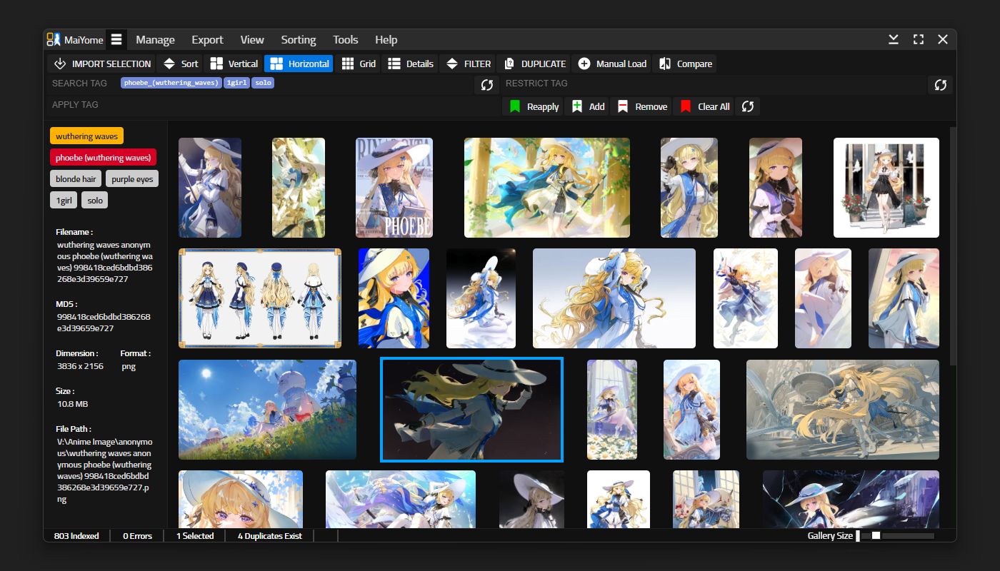
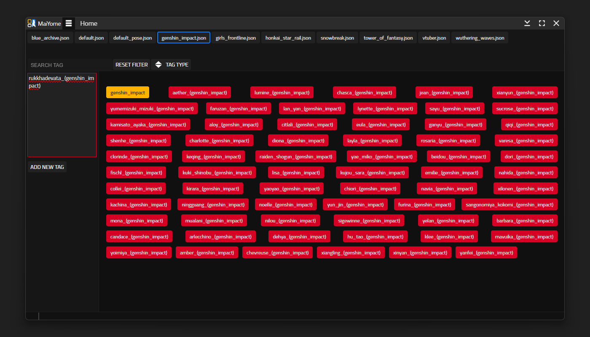

	

# MaiYome 

MaiYome is a *__"JUST A LOCAL BASED BOORU GALLERY DESKTOP APPLICATION"__*.

So, basically it's a DAM or Digital Asset Management-like app to manage all of your waifu images collection which focuses on Tag Management just like a booru style site but it's locally saved. The UI is very simple, a filter tag, and tag editor to remove or add to your image, also an exporter directly to the image file ( which will change the MD5 ) or just export to .json file. 

Currently this application is Active Development but also a final public version, because this application, most of the core function for the Gallery App is already finished, and may or may not be continued in the future unless I need to reconfigure it, but currently there are some features that i need to add so, probably there will be new updated version in the future, i don't know when

This App is also Open-Source but not Open For Contribution, you can modify this app to your liking, but I don't accept any contribution, except the Multi-Language Version ( currently not available yet ). This App also run under electron framework so basically just like a Web-Browser, so most of the core stuff is using Javascript, HTML and CSS. 

### ☆ Planned Features for Future Version
* [ ] ContextMenu
* [ ] Dedicated Settings Page ( currently only JSON File )
* [ ] Image Downloader ( i guess )
* [ ] Multi-Language UI
* [ ] Better UI/UX
* [ ] Change Database on the fly
* [ ] Proper Keyboard Navigation

### ★ Available Features

| Basic Features | Description |
|:--------------:|:--------------:|
| Import Selection | Import All Images inside A Folder. |
| Import All | Import All Images inside A Folder + Subfolder. |
| Import Based on Bolder | Import All Images based on the folder location list |
| Tag Manager | A dedicated manager to add/remove Tag |
| Export Tag To File | Export All Tags directly to the File |
| Export Tag to Json | Export All Tags to .Json File |
| Duplicate Finder | Using fingerprint to find duplicate with adjustable HASH and Sensitivity |
| Image Viewer | Dedicated ImageViewer to view the image in details |
| Image Comparator | Dedicated Image Comparator to compare the details of 2 images |

-----
# → Public Usage
### Requirement

- Windows 10 or UP
- A Decent RAM ( because this is chrome based app )

### Installation

- Go to __Releases__ Page, and download the Latest Version 
※ *There are 2 version 1 with exiftool.exe and one without the exiftool* 
※ *If you download the one without exiftool, you need to download __exiftool__ from the main website and extract the __.exe__ and other files to __resources/app/module/exiftool/exiftool.exe__*

-----
# → Development Only
### Requirement

- __Electron JS__
- __Node.JS__
- __ExifTool__

### Installation

- Clone Git
- Download & Place __ExifTool.exe__ including necessary files into __module/exiftool/exiftool.exe__
- __npm install__ ( make sure all necessary depedencies installed including Node.js )
- then, in __src/__ just __npm run start__
- For Packaging use __npm run package__ 
※ For Note, for *package/make*, make sure not to use __.asar__ because the __sharp__ node_modules doesn't work inside __.asar__

## FAQ / Information

- Current not available

## Screenshots

	
	 
	<em>Main App</em>

	
	 
	<em>TAG Manager</em>

------
